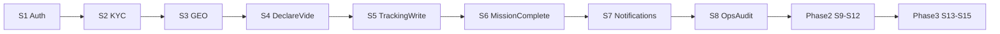

# Roadmap FretCorridor — sprints

> **Source de vérité vivante** pour le pilotage du développement.
> Référence plan d’exécution : `FSE-CDC-FRETCORRIDOR-2026-003` / Plan d’exécution (S1→S15).

| Champ | Valeur |
|-------|--------|
| **Sprint courant** | **MVP Phase 1 clôturé** — prochaine : Phase 2 **S9** |
| **Phase** | Phase 1 — MVP ✅ (web + mobile intégrés sur `dev`) |
| **Dernière mise à jour** | 2026-07-28 |
| **Dernière évolution** | Merge mobile sur `dev` (CRUD `mes-declarations`, sync SQLite, S5 `POST /positions`) ; doc gouvernance / branches |

---

## Règles de suivi (à la lettre)

1. **Un sprint à la fois** — ne pas ouvrir le sprint N+1 tant que les critères de done du sprint N ne sont pas validés.
2. **Intégration via `dev`** — branches `web` et `mobile` mergées sur `dev` sans conflits de fichiers croisés ; realigner ensuite les branches de travail sur `dev`.
3. **Back-end d’abord**, puis mobile et web en parallèle sur le même sprint (packages `api.web` / `api.mobile` / `api.shared`).
4. Après **chaque évolution de code significative** :
   - [ ] Mettre à jour le **statut** du sprint concerné dans ce fichier
   - [ ] Mettre à jour **Sprint courant** + **Dernière mise à jour** + **Dernière évolution**
   - [ ] Si nouvel endpoint / écran : une ligne dans [`CONTEXT.md`](./CONTEXT.md)
   - [ ] Cocher la checklist ci-dessus dans le commit / la PR (ou le message de suivi)

---

## Phase 1 — MVP (S1 → S8)

| Sprint | Fonctionnalité | Statut | Critères de done |
|--------|----------------|--------|------------------|
| **S1** | Auth & sécurité (JWT, login téléphone + PIN, RBAC de base) | **Fait** | Login web + mobile ; refresh ; guards rôles |
| **S2** | Profils & KYC niveau 1 (enrôlement, upload justificatifs) | **Fait** | Enrôlement agent ; KYC en attente + validation admin ; `GET /chauffeurs/me` + upload MinIO |
| **S3** | Réseau & Axes GEO (hubs, états d’activation, zones sensibles, **carte**) | **Fait** | Axes + hubs + activation ; carte Leaflet corridors/hubs + états visibles |
| **S4** | Déclaration camion vide (MKT) | **Fait** | `POST declare-vide` + mobile CRUD `mes-declarations` ; vue chargeur web offres (`GET /missions/offres`) |
| **S5** | Tracking GPS écriture (batch positions, offline) | **Fait** (écriture) | Lecture + carte suivi web ; `POST /positions` + sync offline Flutter. **Reste optionnel :** GPS background |
| **S6** | Mission complète (acceptation, flux A→Z, dashboard bureau) | **Fait** | `POST accepter/demarrer/terminer/annuler` + UI bureau ; GEO 3 flags ; JournalAudit |
| **S7** | Notifications multicanal (NOT) | **Fait** (in-app) | API + centre web + mobile in-app ; FCM/WA/SMS stub ; push Flutter différé |
| **S8** | Back-office & KYC N2 + journal d’audit (OPS) | **Fait** | MinIO upload docs ; validation N1/N2 ; UI `/admin/audit` |

### Ordre strict à partir de maintenant

1. **Phase 2 — S9** — matching backhaul actif (PostGIS, scoring, activation par axe)  
2. Push Flutter / BSP WhatsApp réel — hors scope web actuel  
3. GPS background mobile — optionnel (S5 écriture déjà livrée)

> Périmètre agent web : `api.web` + `web/` + `api.shared` (coordonné). Ne pas implémenter `api.mobile` sans l’équipe mobile.

> **MVP Phase 1** : clôturé côté web le 2026-07-21 ; consolidé mobile + merges sur `dev` jusqu’au 2026-07-28.

---

## Phase 2 — Matching + Paiements (S9 → S12)

> Ne démarrer qu’après clôture S8.

| Sprint | Fonctionnalité | Statut |
|--------|----------------|--------|
| **S9** | Matching backhaul actif (PostGIS, scoring, activation par axe) | À faire |
| **S10** | Paiements Mobile Money (PAY) + ledger | À faire |
| **S11** | Portail partenaire multi-tenant (INT) marque blanche | À faire |
| **S12** | Analytique & reporting (exports PDF/Excel) | À faire |

---

## Phase 3 — Financement + Conformité (S13 → S15)

| Sprint | Fonctionnalité | Statut |
|--------|----------------|--------|
| **S13** | Financement carburant (FIN) cloisonné | À faire |
| **S14** | Conformité multi-juridiction (CMP) LVO/LVI | À faire |
| **S15** | Intermodalité rail (GEO-05) | À faire |

---

## Schéma d’enchaînement

---

## Journal des évolutions (extrait)

| Date | Sprint | Évolution |
|------|--------|-----------|
| 2026-07-28 | S4/S5 | Mobile : sync descendante déclarations + migration SQLite idempotente ; merge `origin/mobile` → `dev` |
| 2026-07-27 | S4 | Merge web+mobile sur `dev` : CRUD `mes-declarations`, doc classes mobile ; smoke Docker OK |
| 2026-07-23 | — | Branches `web` / `mobile` créées ; gouvernance monorepo documentée |
| 2026-07-21 | S8 | MinIO KYC N2 + UI journal audit ; clôture MVP Phase 1 web |
| 2026-07-21 | S7 | NOT : entité + API + centre web ; stubs FCM/WA ; notifs sur transitions mission |
| 2026-07-21 | S6 | Acceptation + cycle A→Z ; GEO 3 flags ; JournalAudit |
| 2026-07-21 | S5 | Carte suivi Leaflet `/bureau/missions` + polling 20s (lecture) |
| 2026-07-21 | S4 | `GET /api/missions/offres` + page chargeur `/chargeur/offres` + seeds |
| 2026-07-21 | S3 | Carte Leaflet bureau/chargeur : hubs + polylines axes |
| 2026-07-20 | S3 / S6 | APIs hubs, missions bureau, tracking/ETA lecture ; design fc-* |
| 2026-07-20 | S1–S2 | Auth, KYC admin, axes, organisation `api.web` / `api.mobile` |

*(Ajouter une ligne à chaque évolution de code.)*
