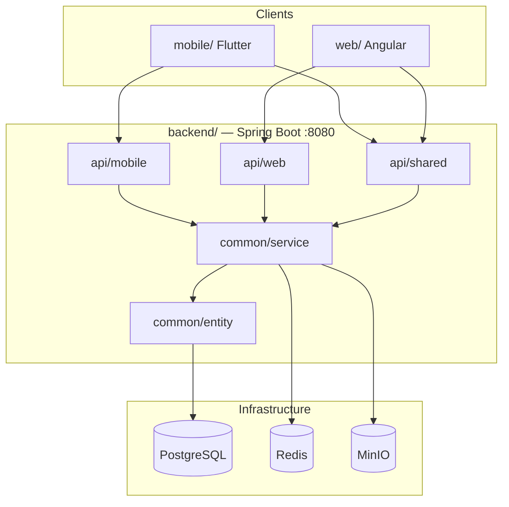

# Analyse comparative & gouvernance monorepo — web / mobile / shared

> **Date :** 2026-07-22 (màj. périmètres : 2026-07-23)  
> **Objectif :** documenter l'organisation du dépôt (annexes mobile vs monorepo), les frontières API entre clients, et le plan d'intégration pour une **démo coordonnée** sans conflits Git.  
> **Références :** [`backend-structure.md`](./backend-structure.md), [`ROADMAP.md`](./ROADMAP.md)

---

## 1. Emplacement des sources

| Rôle | Chemin | Description |
|------|--------|-------------|
| **Référence mobile (annexes)** | `annexes/fretcorridor/flutter/` | App Flutter Sprint 1–3 (Chauffeur & Agent) |
| **Référence backend (annexes)** | `annexes/fretcorridor/backend/` | Backend Spring Boot MVP initial (structure plate) |
| **Backup Sprint 1** | `annexes/fretcorridor/backend_sprint1_backup/` | Sauvegarde intermédiaire |
| **Monorepo — mobile** | `mobile/` | App Flutter intégrée au dépôt |
| **Monorepo — backend** | `backend/` | Backend refactoré (`api/` + `common/`) |
| **Monorepo — web** | `web/` | Portail Angular |

> **Note :** le dossier `annexes/` n'est pas tracké par Git du monorepo (il contient un dépôt `.git` embarqué). Le dossier `assets/` à la racine n'existe pas ; la référence mobile est bien sous `annexes/fretcorridor/`.

---

## 2. Périmètres et responsabilités (équipe)

> **Règle fondamentale :** l'équipe **web** ne maintient pas l'app Flutter. L'équipe **mobile** ne maintient pas le portail Angular.  
> Seul le contrat **`api/shared/`** est partagé et doit rester stable pour la démo.

### 2.1 Qui gère quoi

| Équipe | Code source | API backend | Rôle produit |
|--------|-------------|-------------|--------------|
| **Web (vous)** | `web/` | `api/web/` + **`api/shared/`** | Bureau de fret, chargeur, back-office (KYC, audit, missions) |
| **Mobile (autre dev)** | `mobile/` | `api/mobile/` + **`api/shared/`** | Chauffeur & agent terrain (enrôlement, déclaration vide, GPS…) |
| **Commun (démo)** | — | **`api/shared/`** | Auth JWT, axes, hubs, notifications, tracking **lecture** |

Le dossier `annexes/fretcorridor/` est une **archive de référence** (Sprint 1–3) : utile pour comparer l'historique mobile, **ignoré par Git**, non source de vérité.

### 2.2 Frontières API — qui appelle quoi

#### Portail web (`web/`) — ne consomme **jamais** `api/mobile`

| Domaine | Endpoints web | Package |
|---------|---------------|---------|
| Auth | `POST /auth/login`, `/refresh`, `/logout` | `shared` |
| Réseau | `GET /axes`, `/axes/{id}/statut`, `GET /hubs` | `shared` |
| Notifications | `GET /notifications`, `/non-lues`, `PATCH /{id}/lue` | `shared` |
| Tracking lecture | `GET /missions/{id}/tracking`, `/eta` | `shared` |
| Missions bureau | `GET /missions`, transitions statut | `web` |
| Offres chargeur | `GET /missions/offres` | `web` |
| Admin KYC | `GET /admin/kyc/en-attente`, `PUT /{id}/valider` | `web` |
| Admin chauffeurs | `GET /admin/chauffeurs`, `GET /chauffeurs/{id}` | `web` |
| Audit | `GET /admin/audit` | `web` |

#### App mobile (`mobile/`) — ne consomme **pas** les écrans web

| Domaine | Endpoints mobile | Package |
|---------|------------------|---------|
| Auth, axes, notifications | idem shared ci-dessus | `shared` |
| Enrôlement / KYC terrain | `POST/GET /chauffeurs`, `POST /kyc/documents`, `GET /chauffeurs/me` | `mobile` |
| Modération KYC agent | `GET/PUT /admin/kyc/*` | `web` *(même URL, rôle AGENT)* |
| Déclaration vide | `POST /missions/declare-vide` | `mobile` |
| Matchs (stub S9) | `GET /missions/matchs` | `mobile` |
| GPS écriture (S5) | `POST /positions` | `mobile` |

#### Contrat partagé (`api/shared/`) — stable pour la démo

Les deux apps s'appuient sur les **mêmes URLs** pour :

```
POST /api/auth/login | /refresh | /logout
GET  /api/axes | /axes/{id}/statut
GET  /api/hubs
GET  /api/notifications | /non-lues
PATCH /api/notifications/{id}/lue
GET  /api/missions/{id}/tracking | /eta
```

Toute évolution de ces routes impacte **les deux équipes** → changement coordonné + mise à jour de ce document.

### 2.3 Vérification d'intégrité (2026-07-23)

Contrôles effectués sur la stack Docker (`localhost:4200` web, `localhost:8080` API).

| Vérification | Résultat |
|--------------|----------|
| Tests unitaires backend (`mvn test`) | ✅ OK |
| Web → proxy `/api` → backend | ✅ OK |
| Login démo Agent → `/bureau` + carte axes/hubs | ✅ OK |
| Login démo Opérateur → admin KYC, chauffeurs, audit | ✅ OK (API 200) |
| Login démo Chargeur → `/chargeur/offres` | ✅ OK (`GET /missions/offres`) |
| Agent bureau → `/bureau/missions` | ✅ OK (`GET /missions`) |
| Web n'appelle pas d'endpoints `api/mobile` | ✅ Confirmé (audit code Angular) |

**Note démo mobile :** si le conteneur `fretcorridor-backend` n'a pas été reconstruit après ajout d'endpoints mobile (`GET /chauffeurs/me`, `POST /positions`), l'équipe mobile doit lancer `docker compose up --build`. **Cela n'affecte pas le web.**

### 2.4 Règles de modification (éviter les conflits)

| Action | Équipe web | Équipe mobile |
|--------|------------|---------------|
| Nouvel écran / feature UI | `web/` uniquement | `mobile/` uniquement |
| Endpoint spécifique client | `api/web/` | `api/mobile/` |
| Endpoint commun (auth, axes, notifs…) | `api/shared/` **en accord** | `api/shared/` **en accord** |
| Règle métier / nouvelle table | `common/` (service + entity) | `common/` (service + entity) |
| Copier le backend annexes | ❌ Interdit | ❌ Interdit |

---

## 3. Synthèse exécutive

| Composant | Référence (`annexes/`) | Local (`fretcorridor/`) | Verdict |
|-----------|------------------------|-------------------------|---------|
| **Flutter** | `annexes/.../flutter/` | `mobile/` | **Déjà intégré — code identique** |
| **Backend** | 20 endpoints, 44 fichiers Java, structure plate | ~35 endpoints, 78 fichiers Java, `api/mobile` + `api/web` + `api/shared` | **Local en avance — ne pas réimporter l'annexe** |
| **Git** | Dépôt embarqué, non tracké | `mobile/` tracké ; backend refactoré | Risque de conflit si recopie brute de l'annexe backend |

**Conclusion :** l'intégration Flutter dans le monorepo est faite côté dépôt ; son **évolution relève de l'équipe mobile**. Côté web, la source de vérité est `web/` + `api/web/` + `api/shared/`. Ne pas merger le backend annexes.

---

## 4. Flutter — analyse détaillée

### 4.1 Structure du projet

```
flutter/  (annexes)  ≡  mobile/  (local)
├── lib/
│   ├── main.dart                 # Point d'entrée, routing, splash, dashboards placeholder
│   ├── models/                   # 4 modèles DTO
│   ├── providers/                # 6 providers Riverpod (état + API)
│   ├── screens/                  # 6 écrans
│   ├── services/                 # Auth, GPS, SQLite
│   └── theme/app_theme.dart
├── assets/images/flysoft_logo.png
├── pubspec.yaml
├── update_ip.sh                  # (annexes uniquement) script IP dev
└── android/, ios/, …             # plateformes Flutter
```

**Architecture :** Riverpod (`StateNotifierProvider`) + appels API dans les providers. Pas de couche `repository/` dédiée.

**Package :** `fretcorridor_mobile` v1.0.0+1

### 4.2 Résultat de la comparaison fichier par fichier

**Les 21 fichiers Dart de `lib/` sont strictement identiques** entre :

- `annexes/fretcorridor/flutter/lib/`
- `mobile/lib/`

Fichiers comparés (tous `IDENTICAL`) :

- `main.dart`
- `models/` : `axe_model.dart`, `chauffeur_model.dart`, `declaration_vide_model.dart`, `utilisateur_model.dart`
- `providers/` : `auth_provider.dart`, `axe_provider.dart`, `chauffeur_provider.dart`, `connectivity_provider.dart`, `declaration_vide_provider.dart`, `dio_provider.dart`
- `screens/` : `axes_screen.dart`, `dashboard_agent_screen.dart`, `declaration_vide_screen.dart`, `enrolement_screen.dart`, `login_screen.dart`, `profil_chauffeur_screen.dart`
- `services/` : `auth_service.dart`, `declaration_local_db.dart`, `gps_service.dart`
- `theme/app_theme.dart`

`pubspec.yaml` : identique entre annexes et local.

### 4.3 Endpoints API consommés par le mobile

**Base URL :** configurée via `ApiConfig` (`--dart-define=API_BASE=…`) — voir § 4.9.

| Méthode | Chemin relatif | Fichier source | Corps / headers | Statut |
|---------|----------------|----------------|-----------------|--------|
| `POST` | `/auth/login` | `auth_service.dart` | `{ telephone, codePin }` | ✅ Actif |
| `POST` | `/auth/logout` | `auth_service.dart` | — | ✅ Actif |
| `POST` | `/auth/refresh` | `dio_provider.dart` | `{ refreshToken }` | ✅ Actif (intercepteur 401) |
| `PUT` | `/auth/fcm-token` | `auth_service.dart` | `{ fcmToken }` | ⚠️ Déclaré, jamais appelé |
| `GET` | `/axes` | `axe_provider.dart` | — | ✅ Actif |
| `GET` | `/chauffeurs` | `chauffeur_provider.dart` | — | ✅ Actif |
| `POST` | `/chauffeurs` | `chauffeur_provider.dart` | `{ nom, prenom, telephone, codePinInitial, numeroCNI? }` | ✅ Actif |
| `GET` | `/admin/kyc/en-attente` | `chauffeur_provider.dart` | — | ✅ Actif |
| `PUT` | `/admin/kyc/{id}/valider` | `chauffeur_provider.dart` | `{ approuve, commentaire, nouveauNiveau }` | ✅ Actif |
| `POST` | `/missions/declare-vide` | `declaration_vide_provider.dart` | `{ axeId, latitude, longitude, typeCamion, capaciteTonnes }` + `X-Idempotency-Key` | ✅ Actif |

**Total : 10 endpoints réellement utilisés** (+ 1 déclaré inactif : FCM).

**Client HTTP :** Dio 5.4 avec intercepteur JWT (`Authorization: Bearer`) et refresh automatique sur 401.

### 4.4 Endpoints backend non consommés par le mobile

Le backend local expose des endpoints que l'app mobile n'appelle pas encore :

| Endpoint | Package backend local |
|----------|----------------------|
| `GET /api/missions/matchs` | `api/mobile` |
| `POST /api/kyc/documents` | `api/mobile` |
| `GET/POST /api/camions` | `api/mobile` |
| `GET/POST /api/transporteurs` | `api/mobile` |
| `GET /api/hubs` | `api/shared` |
| `GET /api/notifications`, `/non-lues`, `PATCH /{id}/lue` | `api/shared` |
| `GET /api/missions/{id}/tracking`, `/eta` | `api/shared` |
| `GET /api/axes/{id}/statut` | `api/shared` |
| `GET/POST /api/chargeurs` | `api/web` |
| `GET /api/chauffeurs/{id}` | `api/web` |
| `GET /api/missions`, `/offres`, transitions statut | `api/web` |

### 4.5 Écrans et maturité fonctionnelle

| Écran | Route | Rôle | Maturité |
|-------|-------|------|----------|
| Splash | `home` (chargement) | Vérification session | ✅ Fonctionnel |
| Login | `home` (déconnecté) | Téléphone + PIN | ✅ Fonctionnel |
| Dashboard Agent | `/dashboard-agent` | Stats, KYC, enrôlement | ✅ Fonctionnel |
| Enrôlement | modal / route | Formulaire chauffeur | ✅ Fonctionnel |
| Axes | `/axes` | Liste corridors | ✅ Fonctionnel |
| Déclaration vide | `/declaration-vide` | Offline-first + sync | ✅ Fonctionnel |
| Profil chauffeur | `/profil-chauffeur` | Profil KYC | ⚠️ Données mockées |
| Dashboard Chauffeur | `/dashboard-chauffeur` | Placeholder | ⚠️ Sprint 2/3 |
| Dashboard Client | `/dashboard-client` | Placeholder | ⚠️ Non implémenté |

**Rôles supportés :** `CHAUFFEUR`, `AGENT`, `CLIENT` — redirection post-login selon `utilisateur.role`.

La sélection CHAUFFEUR/AGENT sur l'écran login est **cosmétique** (non envoyée à l'API).

### 4.6 Modèles / DTOs locaux

| Modèle | Fichier | Champs principaux |
|--------|---------|-------------------|
| `UtilisateurModel` | `utilisateur_model.dart` | `accessToken`, `refreshToken`, `role`, `tenantId`, `configTenant` |
| `ConfigTenant` | *(nested)* | `tenantId`, `nomBureau`, `langue`, `devise`, `axesDisponibles` |
| `ChauffeurModel` | `chauffeur_model.dart` | `id`, `nom`, `prenom`, `telephone`, `kycNiveau`, `statutKyc`, documents… |
| `AxeModel` | `axe_model.dart` | `id`, `nom`, `hubDepart`, `hubArrivee`, `etatActivation`, `zoneSensible` |
| `DeclarationVideModel` | `declaration_vide_model.dart` | `idLocal` (UUID), coords GPS, `synchronise` |

### 4.7 Flux d'authentification

```
Démarrage app
    ↓
authProvider._verifierSession()
    ↓
AuthService.recupererSessionLocale()
    → lit access_token + utilisateur depuis FlutterSecureStorage
    ↓
Si token + user → estConnecte=true → redirect par rôle
Sinon → LoginScreen

Login:
    POST /auth/login { telephone, codePin }
    → stocke accessToken, refreshToken, utilisateur (JSON)
    → redirect: AGENT → DashboardAgent, CHAUFFEUR/CLIENT → PlaceholderDashboard

Requêtes API:
    dioProvider intercepteur → Authorization: Bearer {accessToken}
    Si 401 → POST /auth/refresh { refreshToken }
        → met à jour tokens → retry requête originale
        → sinon efface tokens

Logout:
    POST /auth/logout (best-effort)
    → efface SecureStorage → reset AuthState
```

**Stockage sécurisé (`flutter_secure_storage`) :** `access_token`, `refresh_token`, `utilisateur`.

**Limites :** session locale restaurée **sans validation serveur** au cold start.

### 4.8 Dépendances (`pubspec.yaml`)

| Package | Version | Usage réel |
|---------|---------|------------|
| `flutter_riverpod` | ^2.6.1 | ✅ State management |
| `dio` | ^5.4.0 | ✅ Client HTTP |
| `flutter_secure_storage` | ^10.3.1 | ✅ JWT / session |
| `geolocator` | ^14.0.3 | ✅ GPS déclarations |
| `sqflite` + `path` | ^2.3 / ^1.8 | ✅ DB locale offline |
| `uuid` | ^4.3.3 | ✅ Idempotence déclarations |
| `connectivity_plus` | ^7.2.0 | ✅ Sync offline |
| `google_fonts` | ^6.2.1 | ✅ Thème |
| `intl_phone_field` | ^3.2.0 | ✅ Enrôlement |
| `go_router` | ^17.3.0 | ❌ Non utilisé (MaterialApp routes) |
| `firebase_core` / `firebase_messaging` | ^4.12 / ^16.4 | ❌ Non initialisés |
| `cached_network_image` | ^3.3.1 | ❌ Non utilisé |
| `image_picker` | ^1.2.3 | ❌ Non branché (TODO profil) |

### 4.9 Configuration réseau

| Élément | Détail |
|---------|--------|
| **API URL** | `lib/core/config/api_config.dart` — `--dart-define=API_BASE=…` (défaut `127.0.0.1:8080`) |
| **Script dev** | `mobile/scripts/run_dev.sh` (équipe mobile) |
| **Android cleartext** | `usesCleartextTraffic="true"` (HTTP autorisé en dev) |

### 4.10 Écarts annexes vs local (hors code Dart)

| Élément | Annexes | Local `mobile/` |
|---------|---------|-----------------|
| Code `lib/` | Identique | Identique |
| `update_ip.sh` | ✅ Présent | ❌ Absent |
| `.github/` CI | ✅ Présent | ❌ Absent |
| Dossier parasite `{screens,providers,...}` | Présent | Absent |
| Artefacts build (`.gradle`, `.idea`) | Présents | Ignorés par `.gitignore` |

---

## 5. Backend — analyse détaillée

### 5.1 Architecture comparative

```
ANNEXES (Sprint 1–3)                    LOCAL (MVP Phase 1 clôturé)
─────────────────────                   ────────────────────────────
com.flysoft.fretcorridor/               com.flysoft.fretcorridor/
├── config/SecurityConfig               ├── api/
├── controller/          (7 ctrl)       │   ├── mobile/     (4 ctrl)
├── dto/                                │   ├── web/        (7 ctrl)
├── entity/              (9 ent.)      │   └── shared/     (5 ctrl)
├── repository/                         ├── common/
├── security/                           │   ├── config/     (Security, MinIO, DataInit…)
└── service/             (7 svc)        │   ├── dto/
                                        │   ├── entity/     (12 ent.)
                                        │   ├── repository/
                                        │   ├── security/   (+ RoleChecks)
                                        │   └── service/    (12 svc)
                                        └── FretCorridorApplication.java
```

**Une seule app Spring Boot** sur le port `8080` — pas deux backends.

### 5.2 Endpoints annexes (20 routes)

#### AuthController — `/api/auth`

| Méthode | Chemin | Auth |
|---------|--------|------|
| `POST` | `/api/auth/login` | Public |
| `POST` | `/api/auth/refresh` | Public |
| `POST` | `/api/auth/logout` | JWT |
| `PUT` | `/api/auth/fcm-token` | JWT |

#### AxeController — `/api`

| Méthode | Chemin | Auth |
|---------|--------|------|
| `GET` | `/api/axes` | JWT |
| `GET` | `/api/axes/{id}/statut` | JWT |

#### ChauffeurController — `/api`

| Méthode | Chemin | Auth | Rôle |
|---------|--------|------|------|
| `POST` | `/api/chauffeurs` | JWT | `AGENT` |
| `GET` | `/api/chauffeurs/{id}` | JWT | — |
| `GET` | `/api/chauffeurs` | JWT | `AGENT` |
| `GET` | `/api/admin/kyc/en-attente` | JWT | `AGENT` |
| `PUT` | `/api/admin/kyc/{id}/valider` | JWT | `AGENT` |
| `POST` | `/api/kyc/documents` | JWT | — |

#### MissionController — `/api/missions`

| Méthode | Chemin | Auth | Headers |
|---------|--------|------|---------|
| `POST` | `/api/missions/declare-vide` | JWT | `X-Idempotency-Key` obligatoire |
| `GET` | `/api/missions/matchs` | JWT | — (stub `[]`) |

#### Autres contrôleurs annexes

| Contrôleur | Endpoints |
|------------|-----------|
| `CamionController` | `POST/GET /api/camions` |
| `TransporteurController` | `POST/GET /api/transporteurs` |
| `ChargeurController` | `POST/GET /api/chargeurs` |

### 5.3 Endpoints locaux (~35 routes)

#### `api/mobile/` — App Flutter

| Contrôleur | Endpoints |
|------------|-----------|
| `MissionController` | `POST /declare-vide`, `GET /matchs` |
| `ChauffeurController` | `POST/GET /chauffeurs`, `POST /kyc/documents` |
| `CamionController` | `POST/GET /camions` |
| `TransporteurController` | `POST/GET /transporteurs` |

#### `api/shared/` — Web + Mobile

| Contrôleur | Endpoints |
|------------|-----------|
| `AuthController` | `POST /login`, `/refresh`, `/logout`, `PUT /fcm-token` |
| `AxeController` | `GET /axes`, `/axes/{id}/statut` |
| `HubController` | `GET /hubs` |
| `NotificationController` | `GET /`, `/non-lues`, `PATCH /{id}/lue`, `POST /send` |
| `TrackingController` | `GET /{id}/tracking`, `GET /{id}/eta` |

#### `api/web/` — Portail Angular

| Contrôleur | Endpoints |
|------------|-----------|
| `MissionBureauController` | `GET /`, `GET /{id}`, `POST /{id}/accepter\|demarrer\|terminer\|annuler` |
| `MissionChargeurController` | `GET /offres` |
| `AxeAdminController` | `PATCH /{id}/activation` |
| `AdminKycController` | `GET /en-attente`, `PUT /{id}/valider` |
| `ChauffeurAdminController` | `GET /admin/chauffeurs`, `GET /chauffeurs/{id}` |
| `AdminAuditController` | `GET /admin/audit` |
| `ChargeurController` | `POST/GET /chargeurs` |

#### Inventaire complet des URLs locales

```
POST   /api/auth/login
POST   /api/auth/refresh
POST   /api/auth/logout
PUT    /api/auth/fcm-token

GET    /api/axes
GET    /api/axes/{id}/statut
PATCH  /api/axes/{id}/activation

GET    /api/hubs

GET    /api/chauffeurs              (mobile: agent)
POST   /api/chauffeurs              (mobile: agent)
GET    /api/chauffeurs/{id}         (web)
GET    /api/admin/chauffeurs        (web back-office)
POST   /api/kyc/documents           (mobile multipart)
GET    /api/admin/kyc/en-attente
PUT    /api/admin/kyc/{id}/valider

POST   /api/missions/declare-vide
GET    /api/missions/matchs
GET    /api/missions                (web bureau)
GET    /api/missions/offres         (web chargeur)
GET    /api/missions/{id}
POST   /api/missions/{id}/accepter
POST   /api/missions/{id}/demarrer
POST   /api/missions/{id}/terminer
POST   /api/missions/{id}/annuler
GET    /api/missions/{id}/tracking
GET    /api/missions/{id}/eta

POST   /api/camions
GET    /api/camions
POST   /api/transporteurs
GET    /api/transporteurs
POST   /api/chargeurs
GET    /api/chargeurs

GET    /api/notifications
GET    /api/notifications/non-lues
PATCH  /api/notifications/{id}/lue
POST   /api/notifications/send

GET    /api/admin/audit
```

### 5.4 Table de correspondance annexes → local

| Endpoint annexes | Emplacement local | Changement notable |
|------------------|-------------------|--------------------|
| `POST /api/auth/*` | `api/shared/AuthController` | Rate limiting Redis, variables d'env |
| `GET /api/axes` | `api/shared/AxeController` | DTO enrichi (flags GEO) |
| `POST/GET /api/chauffeurs` | `api/mobile/ChauffeurController` | Identique côté mobile |
| `GET /api/chauffeurs/{id}` | `api/web/ChauffeurAdminController` | **Même URL**, déplacé vers web |
| `GET/PUT /api/admin/kyc/*` | `api/web/AdminKycController` | **Même URL** ; RBAC via `RoleChecks` |
| `POST /api/kyc/documents` | `api/mobile/ChauffeurController` | MinIO réel (annexe = URL fictive) |
| `POST /api/missions/declare-vide` | `api/mobile/MissionController` | Règles GEO plus strictes |
| `GET /api/missions/matchs` | `api/mobile/MissionController` | Stub `[]` des deux côtés |
| `POST/GET /api/camions` | `api/mobile/CamionController` | Identique |
| `POST/GET /api/transporteurs` | `api/mobile/TransporteurController` | Identique |
| `POST/GET /api/chargeurs` | `api/web/ChargeurController` | Déplacé vers web |

### 5.5 Entités et services ajoutés en local

#### Nouvelles entités (absentes des annexes)

| Entité | Rôle |
|--------|------|
| `PositionGps` | Historique positions mission (tracking) |
| `Notification` | Notifications in-app / push |
| `JournalAudit` | Traçabilité actions back-office |

#### Nouveaux services (absents des annexes)

| Service | Rôle |
|---------|------|
| `DocumentStorageService` | Upload KYC via MinIO (S8) |
| `HubService` | Points du réseau (carte) |
| `TrackingService` | Lecture GPS + ETA (Haversine) |
| `NotificationService` | CRUD notifications |
| `JournalAuditService` | Audit ops |

#### Services enrichis

| Service | Évolution |
|---------|-----------|
| `MissionService` | 69 → 233 lignes : cycle mission complet, offres, audit, notifications |
| `ChauffeurService` | Upload MinIO, validation KYC N2, audit |
| `AuthService` | Rate limiting login, variables d'env |
| `AxeService` | Flags GEO (`visibiliteActive`, `matchingActif`) |

### 5.6 Sécurité — comparaison

| Aspect | Annexes | Local |
|--------|---------|-------|
| Mode | Stateless | Stateless |
| Endpoints publics | `/auth/login`, `/auth/refresh` | Identique |
| RBAC | Vérification manuelle `"AGENT".equals(role)` | `RoleChecks.isBackOffice()` (AGENT, ADMIN, OPERATEUR, BUREAU…) |
| JWT claims | `sub`, `role`, `tenantId`, `telephone` | Identique |
| Refresh tokens | Redis TTL 30j | Identique + config env |
| PIN | BCrypt, 3 tentatives max | Identique + rate limit 15/min |
| Exception handling | Inline dans contrôleurs | `ApiExceptionHandler` centralisé |
| Headers sécurité | — | `X-Frame-Options`, `Referrer-Policy` |

### 5.7 Configuration — `application.yml`

| Aspect | Annexes | Local |
|--------|---------|-------|
| Datasource | Valeurs en dur | Variables `${SPRING_DATASOURCE_*}` |
| Redis | `localhost:6379` en dur | `${SPRING_REDIS_*}` |
| JWT secret | En dur | `${JWT_SECRET:…}` |
| MinIO | Absent | Config complète (S8) |
| Logging | DEBUG | `${LOG_LEVEL_*:INFO}` |
| Profil Docker | Absent | `application-docker.yml` |

---

## 6. Matrice de compatibilité mobile ↔ backend local

| Appel mobile | Backend local | Statut | Notes |
|--------------|---------------|--------|-------|
| Auth (login/refresh/logout) | `api/shared` | ✅ OK | Rate limiting transparent |
| Axes | `api/shared` | ✅ OK | DTO enrichi rétrocompatible |
| Déclaration vide | `api/mobile` | ✅ OK | Vérifier flags axe actifs en dev |
| Enrôlement chauffeurs | `api/mobile` | ✅ OK | — |
| KYC admin (`/admin/kyc/*`) | `api/web` (même URL) | ✅ OK | Rôle AGENT accepté via `RoleChecks` |
| Upload KYC | `api/mobile` | ⚠️ Backend prêt | Mobile non branché |
| Matchs | `api/mobile` | ⚠️ Stub `[]` | À implémenter S9 |
| Tracking / ETA | `api/shared` | ⚠️ Backend prêt | Mobile non consommateur |
| Notifications | `api/shared` | ⚠️ Backend prêt | Firebase non initialisé |
| `GET /chauffeurs/{id}` | `api/web` | ⚠️ Backend prêt | Profil mobile mocké |

### Points d'attention

1. **Validation KYC locale** peut renvoyer `400 DOCS_MANQUANTS` — le mobile devra gérer ce cas.
2. **Déclaration vide** : le local vérifie `axe.isMatchingActif()` en plus de `visibiliteActive` — erreur `AXE_VERROUILLE` possible si axe mal configuré.
3. **`GET /chauffeurs/{id}`** déplacé de mobile vers web — même URL, pas de régression tant que le profil reste mocké.

---

## 7. Comparaison avec une app fret mobile typique

| Fonctionnalité | App fret typique | FretCorridor local |
|----------------|------------------|-------------------|
| Auth | Email/OAuth/biométrie | Téléphone + PIN, JWT refresh — **solide pour terrain** |
| Missions actives | Liste, détail, accepter/refuser | Backend complet (web) ; mobile = **placeholder chauffeur** |
| Matching fret | Algorithme + notifications | `GET /matchs` = **stub vide** |
| Tracking GPS continu | Envoi positions background | GPS **uniquement** à la déclaration vide ; pas de `POST /positions` |
| Push notifications | Firebase branché | Dépendances présentes, **non initialisées** |
| Documents (POD, CMR, KYC) | Capture photo + upload | Backend `POST /kyc/documents` ; mobile **image_picker non branché** |
| Offline | Sync multi-entités | **Offline-first** déclarations vide (SQLite + idempotence) — point fort |
| Marketplace / offres | Chauffeur voit les loads | Côté **web chargeur** ; absent mobile |
| Enrôlement terrain | Rare | **Complet côté agent** (enrôler + valider KYC) |
| Multi-tenant | Variable | **Natif** (tenantId dans JWT, axes par bureau) |
| Flotte camions | Gestion transporteur | Backend prêt ; **mobile ne l'appelle pas** |
| Carte / hubs | Carte interactive | Backend `GET /hubs` ; **mobile sans carte** |

---

## 8. Plan d'intégration structuré (sans conflits)

### 8.1 Ce qu'il ne faut PAS faire

1. **Ne pas copier** `annexes/fretcorridor/backend/` dans le monorepo — le local est un sur-ensemble refactoré.
2. **Ne pas recopier** le code Flutter — déjà présent et identique dans `mobile/`.
3. **Ne pas committer** `annexes/` tel quel — dépôt Git embarqué + artefacts build.

### 8.2 Phase A — Consolidation (risque nul) ✅

| Action | Détail | Statut |
|--------|--------|--------|
| Documenter | Ce fichier (`docs/analyse-integration-mobile.md`) | ✅ Fait (2026-07-22) |
| Ignorer annexes | `annexes/` ajouté au `.gitignore` (archive locale non versionnée) | ✅ Fait |
| Récupérer utilitaires | Copie adaptée : `mobile/scripts/update_ip.sh` (annexes **non modifiées**) | ✅ Fait |
| CI mobile | Annexes : pas de workflow Flutter utile (seulement hooks `modernize/java-upgrade`) — **reporté** | ⏭️ N/A |

**Garanties Phase A :** aucun fichier sous `annexes/` n'a été modifié ; seuls le monorepo (`mobile/`, `.gitignore`, docs) a été enrichi.

### 8.3 Phase B — Alignement mobile sur backend local ✅

| Sprint | Livrable | Statut |
|--------|----------|--------|
| **S2/S8** | Profil chauffeur branché (`GET /chauffeurs/me`) + upload KYC (`POST /kyc/documents` + `image_picker`) | ✅ Fait |
| **S7** | Centre notifications mobile (`GET /notifications`, `/non-lues`, `PATCH /{id}/lue`) | ✅ Fait (sans Firebase push — différé) |
| **S6** | Dashboard chauffeur structuré (remplace placeholder) | ✅ Fait |
| **S9** | Écran matchs consommant `GET /missions/matchs` (stub backend) | ✅ Fait |
| **S5** | `POST /api/positions` backend + sync offline Flutter | ✅ Fait (capture manuelle ; GPS fond différé) |

**Backend ajouté (additif, sans impact annexes) :**

- `GET /api/chauffeurs/me` — `api/mobile/ChauffeurController`
- `POST /api/positions` — `api/mobile/PositionController`
- Contrôle d'accès upload KYC : chauffeur ne peut uploader que son propre profil

**Mobile ajouté :**

- `providers/` : `profil_chauffeur`, `notification`, `matchs`, `tracking`
- `screens/` : `dashboard_chauffeur`, `notifications`, `matchs`
- SQLite v2 : colonne `mission_id` + table `positions_pending`

**Non livré (Phase B — report explicite) :**

- Firebase / `PUT /fcm-token` (nécessite `google-services.json`)
- GPS background continu (foreground service Android)
- Écrans mission complète S6 (accepter/démarrer/terminer — endpoints web aujourd'hui)

### 8.4 Phase C — Qualité et configuration ✅

| Action | Détail | Statut |
|--------|--------|--------|
| Config API | `lib/core/config/api_config.dart` + `--dart-define=API_BASE=…` | ✅ Fait |
| Script dev | `scripts/run_dev.sh` (IP auto / `--emulator`) ; `update_ip.sh` déprécié | ✅ Fait |
| Dépendances | Retrait `go_router`, `firebase_*`, `cached_network_image` (non utilisés) | ✅ Fait |
| Profil chauffeur | Branché Phase B (`GET /chauffeurs/me`) | ✅ (Phase B) |
| Tests | `api_config_test`, `chauffeur_model_test`, smoke `widget_test` | ✅ Fait |

**Firebase push (S7)** reste reporté — réintroduire `firebase_core` / `firebase_messaging` quand `google-services.json` sera disponible.

### 8.5 Structure cible du monorepo

```
fretcorridor/
├── backend/          ← source de vérité (api/mobile + shared + web)
├── mobile/           ← source de vérité Flutter (déjà à jour vs annexes)
├── web/              ← portail Angular
├── docs/             ← ROADMAP, backend-structure, ce document
└── annexes/          ← archive locale (ignorée par git) OU supprimée
```

---

## 9. Convention pour les prochains sprints

| Besoin | Équipe web | Équipe mobile | Où coder |
|--------|------------|---------------|----------|
| Écran Angular (bureau, chargeur, admin) | ✅ | — | `web/` + `api/web/` |
| Écran Flutter (chauffeur, agent terrain) | — | ✅ | `mobile/` + `api/mobile/` |
| Endpoint commun (auth, axes, notifs, tracking lecture) | ✅ accord | ✅ accord | `api/shared/` + `common/` |
| Nouvelle table / règle métier | ✅ | ✅ | `common/entity` + `repository` + `service` |

> **Équipe web :** ne pas implémenter de features dans `mobile/` ni d'endpoints dans `api/mobile/`.  
> **Équipe mobile :** ne pas implémenter de features dans `web/` ni d'endpoints dans `api/web/`.

---

## 10. Annexe — schéma d'architecture



---

## 11. Historique

| Date | Évolution |
|------|-----------|
| 2026-07-22 | Analyse initiale comparative annexes vs monorepo local |
| 2026-07-23 | Section 2 « Périmètres et responsabilités » : web vs mobile vs shared, vérification intégrité démo |
| 2026-07-22 | Phase C : ApiConfig dart-define, run_dev.sh, nettoyage deps, tests unitaires |
